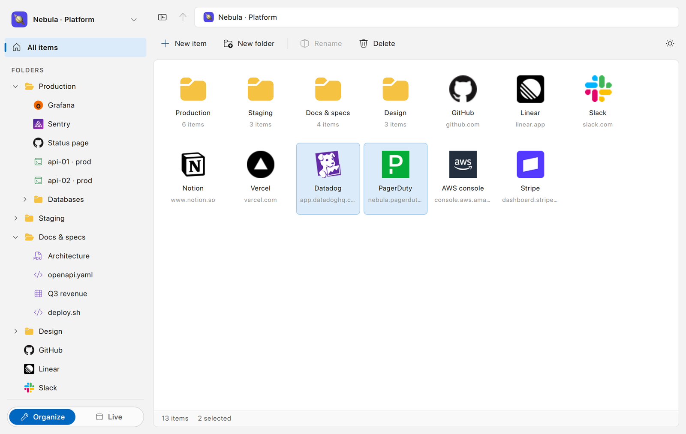
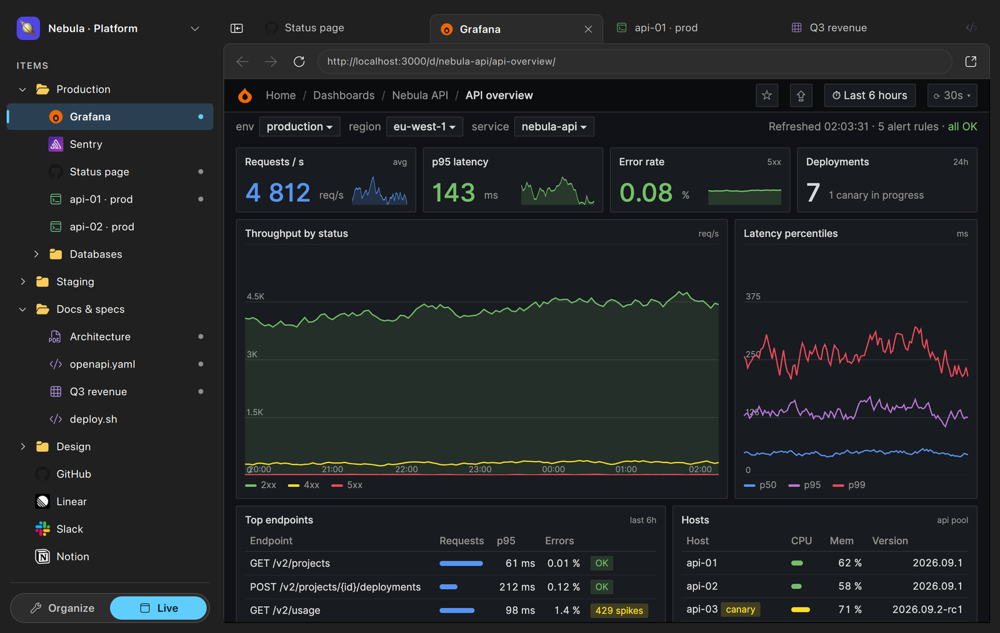
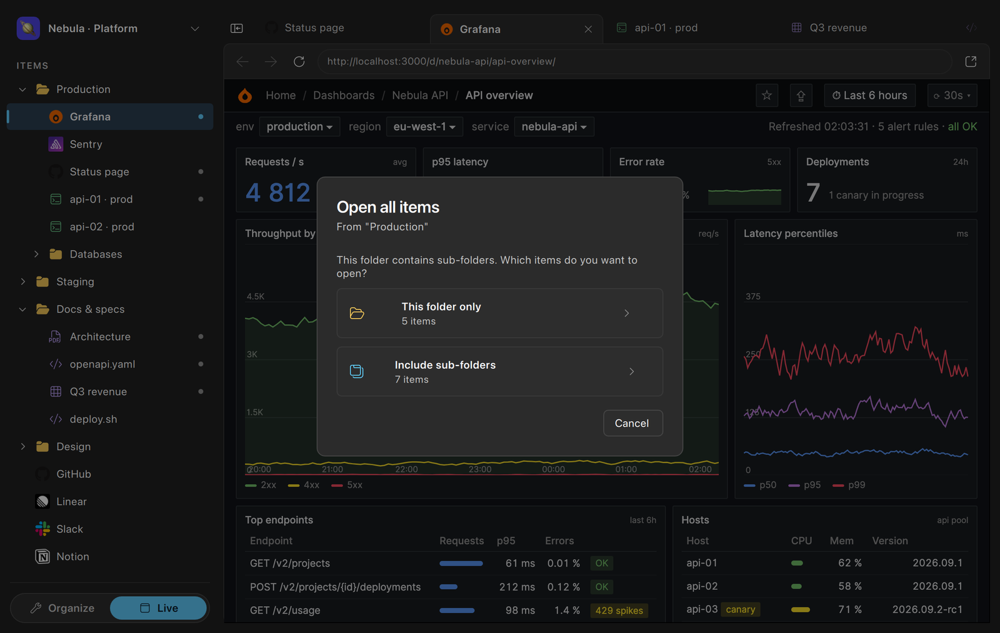
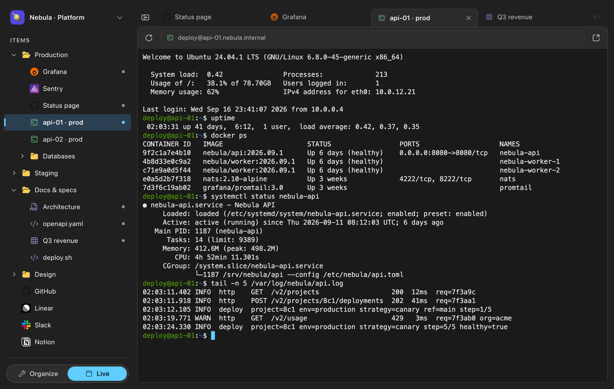
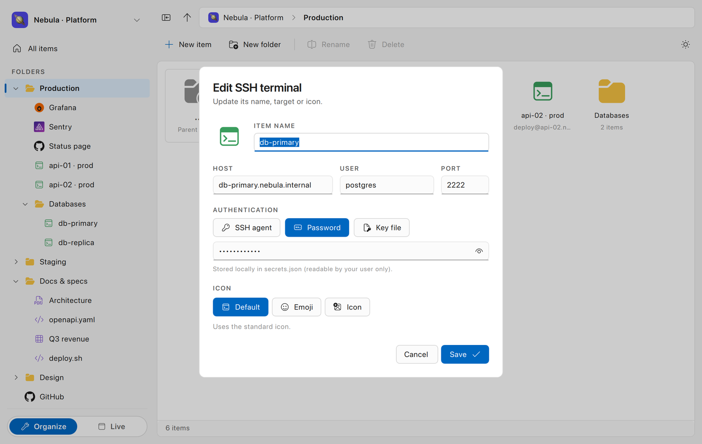
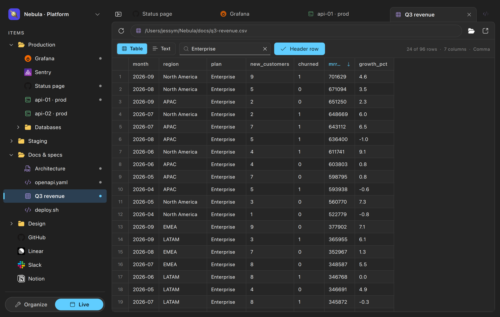
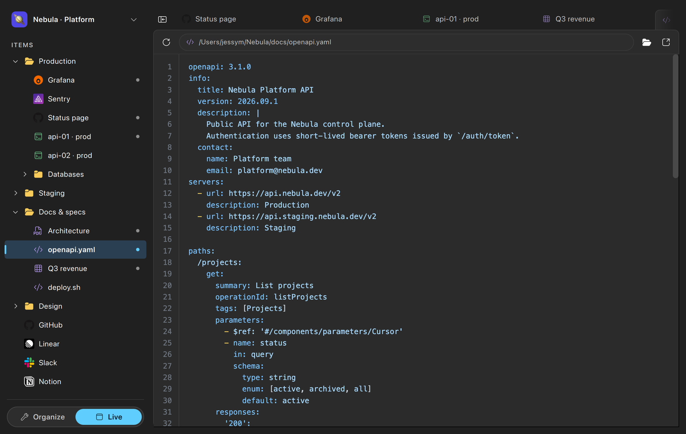
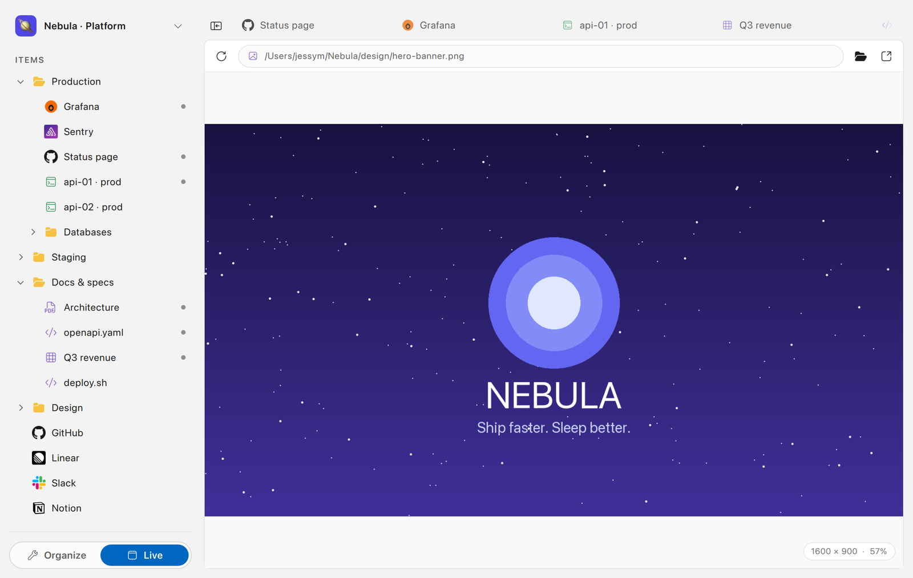

<div align="center">


# Silo

**Everything a project needs, one window.**
Web apps, SSH hosts and local files, organized like a file explorer and opened side by side in tabs that survive restarts.

<sub>Qt 6 · QML · C++20 · macOS / Windows / Linux</sub>

<br>



</div>

<br>

## Two modes, one tree

Silo has a single mental model: workspaces contain folders, folders contain items. An item is a **web page**, an **SSH terminal** or a **local file**. You switch between two views of the same tree from the bottom of the sidebar.

**Organize** looks and behaves like Windows Explorer. Tiles on a grid, breadcrumbs, a `..` tile to move things up, shift- and ctrl-click selection, drag & drop between folders and into the sidebar, rename in place with <kbd>Space</kbd>, copy and paste whole sub-trees with <kbd>Ctrl</kbd>+<kbd>C</kbd> / <kbd>V</kbd>.

**Live** turns the same tree into a launcher. Click a leaf, it opens in a tab on the right. Tabs are kept per workspace, persisted to disk and restored lazily on the next start, so a carefully laid-out set of dashboards, shells and documents is never lost.



<sub>Web pages run in a real Chromium engine (Qt WebEngine), not an iframe: no `X-Frame-Options` or `frame-ancestors` headaches.</sub>

<br>

## Open a whole folder at once

<kbd>Ctrl</kbd>/<kbd>Cmd</kbd>+click a folder, or pick *Open all items* from its context menu. When the folder has sub-folders, Silo asks whether to include them.



<br>

## SSH, without leaving the window

An SSH item is a host, a user and a port. Authentication can go through your agent, a key picked from `~/.ssh` or a password stored in a `0600` `secrets.json` next to your library. In Live mode it becomes a full xterm.js terminal.





<br>

## Files that open in place

Point a File item at a path and Live mode picks the right viewer: PDF, images, video and audio (with <kbd>Space</kbd> to play/pause and a smooth playhead), an editor with syntax highlighting for anything text-like, and a proper table for CSV. Text and CSV files (in both table and text mode) are editable in place and saved automatically.

The CSV viewer detects the delimiter, toggles the header row, sorts by column, filters as you type and copies cells or rows to the clipboard. A *Text* toggle shows the raw file next to it.







<br>

## Small things that add up

- Light, dark, or follow the system. Every color is a token, so both themes are first-class.
- Favicons are fetched and cached for web items; any item or workspace can get an emoji or a Fluent icon instead.
- Full keyboard navigation in the tree: <kbd>↑</kbd>/<kbd>↓</kbd> to move, <kbd>Tab</kbd> to expand or collapse, <kbd>Enter</kbd> to open, <kbd>Space</kbd> to rename, <kbd>Delete</kbd> to remove (with confirmation).
- <kbd>Ctrl</kbd>/<kbd>Cmd</kbd>+<kbd>B</kbd> hides the sidebar. <kbd>Ctrl</kbd>+<kbd>Tab</kbd> cycles tabs, <kbd>Ctrl</kbd>+<kbd>W</kbd> closes one.
- No account, no server. Your library is a `library.json` you can read, diff and back up.
- A workspace exports to a single `.silo.json` (tree, custom icons embedded, SSH passwords only if you ask) and imports back as a new workspace, on any machine.

<br>

## Build

Requires Qt 6.5+ with the `WebEngineQuick`, `WebChannelQuick` and `Multimedia` modules, CMake 3.21+ and a C++20 compiler.

```sh
make run          # configure, build and launch
```

`make rerun` rebuilds and launches, `make clean` wipes the build directory. Icons and web bundles (xterm.js, Ace) are vendored in `icons/` and `web/vendor/`; `make icons` and `make web-assets` refresh them from the CDN.

Data lives in the platform's application data folder (`library.json`, `session.json`, `secrets.json`). Set `SILO_DATA_DIR` to point somewhere else, which is handy for trying a throwaway library.

<br>

<div align="center">
<sub>The screenshots use a fictional "Nebula" workspace. Any resemblance to a real platform team's Tuesday is coincidental.</sub>
</div>
